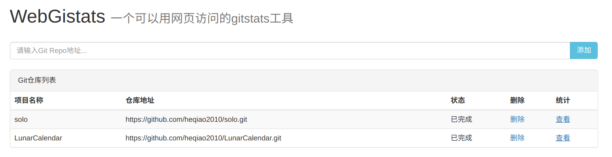
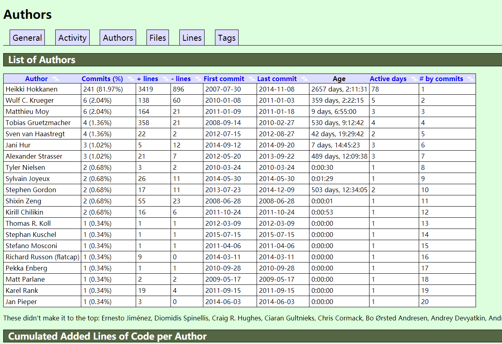

## 介绍

```
--------------------------------------------------------------------------------------------------------------------
                                                  WebGistats
--------------------------------------------------------------------------------------------------------------------

 ___       __   _______   ________  ________  ___  _________  ________  _________  ________  _________  ________
|\  \     |\  \|\  ___ \ |\   __  \|\   ____\|\  \|\___   ___\\   ____\|\___   ___\\   __  \|\___   ___\\   ____\
\ \  \    \ \  \ \   __/|\ \  \|\ /\ \  \___|\ \  \|___ \  \_\ \  \___|\|___ \  \_\ \  \|\  \|___ \  \_\ \  \___|_
 \ \  \  __\ \  \ \  \_|/_\ \   __  \ \  \  __\ \  \   \ \  \ \ \_____  \   \ \  \ \ \   __  \   \ \  \ \ \_____  \
  \ \  \|\__\_\  \ \  \_|\ \ \  \|\  \ \  \|\  \ \  \   \ \  \ \|____|\  \   \ \  \ \ \  \ \  \   \ \  \ \|____|\  \
   \ \____________\ \_______\ \_______\ \_______\ \__\   \ \__\  ____\_\  \   \ \__\ \ \__\ \__\   \ \__\  ____\_\  \
    \|____________|\|_______|\|_______|\|_______|\|__|    \|__| |\_________\   \|__|  \|__|\|__|    \|__| |\_________\
                                                                \|_________|                              \|_________|

--------------------------------------------------------------------------------------------------------------------
```

一个可以用网页访问的gitstats工具，用于统计git提交情况。原来gitstats的工具,在linux环境下使用比较方便
(其他平台安装gunplot等工具比较麻烦),需要通过手动运行gitstat脚本生成文件,比较麻烦;
webGitstats就是用于解决这个问题,提供一个web环境,用于生成统计图表,用浏览器访问.

## 预览



## 如何使用

依次执行：

```
git clone https://github.com/heqiao2010/webGitstats.git
cd webGitstats
mvn install
mvn package
java -jar ./target/web-gitstats.war
```

然后在浏览器中打开：http://localhost:8080

## 依赖
gitstas是一个能够计算git仓库贡献数据的脚本程序，依赖Git，Python，Gnuplot工具分析每一次提交，请再使用前先将这些工具安装在服务器上。

gitstats: https://github.com/hoxu/gitstats
